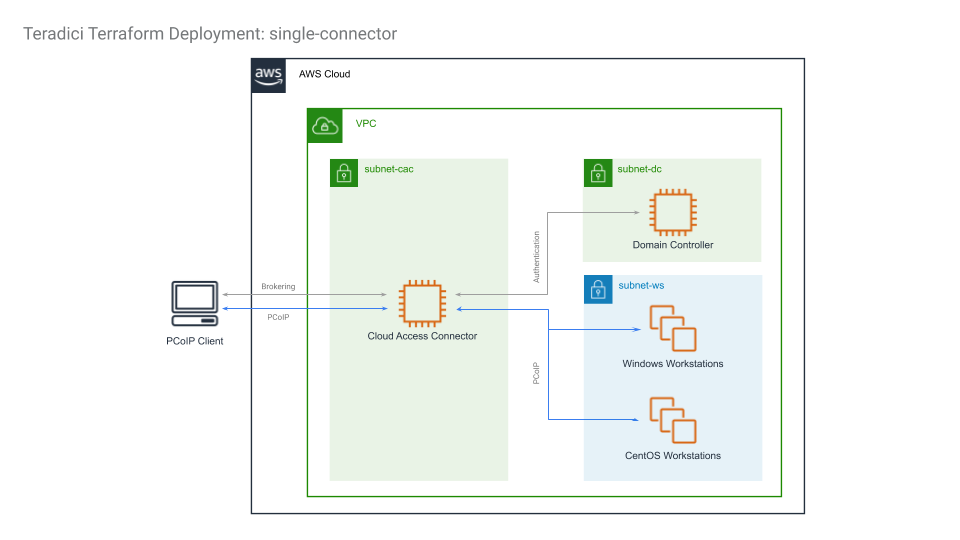
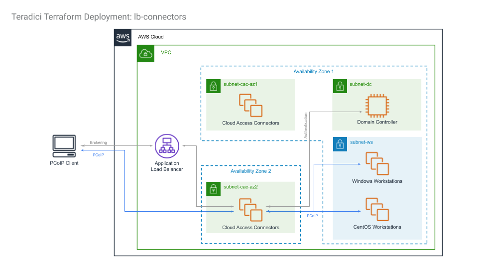
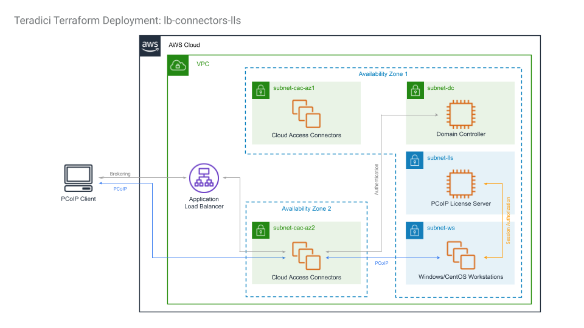

# Amazon Web Services Deployments

## Running Terraform Scripts

### Requirements
- the user must have Administrator permissions in an AWS account
- a PCoIP Registration Code is needed. Contact Teradici sales or purchase subscription here: https://www.teradici.com/compare-plans
- a PCoIP License Server Activation Code is needed for Local License Server (LLS) based deployments.
- an SSH private / public key pair is required for Terraform to log into Linux hosts.
- if SSL is involved, the SSL key and certificate files are needed in PEM format.
- Terraform v0.12.x must be installed. Please download Terraform from https://www.terraform.io/downloads.html

### AWS Setup
Although it is possible to create deployments in existing and currently in-use accounts, it is recommended to create them in new accounts to reduce chances of name collisions and interfering with operations of existing resources.

With a new AWS account:
- from the AWS console, create a new IAM user with programmatic access and apply the __AdministratorAccess__ policy either by adding the user to a group with such permission, or by attaching the policy to the user directly. Copy the Access key ID and Secret access key into an AWS Credential File as shown below. These credentials are needed by the Terraform scripts to create the initial deployment. Please see https://docs.aws.amazon.com/cli/latest/userguide/cli-configure-files.html for more details on AWS Credential Files.
```
[default]
aws_access_key_id = <your_id>
aws_secret_access_key = <your_key>
```
- in the AWS marketplace portal, visit the Product Overview pages of AMI images that will be used by Terraform scripts. Click on the "Continue to Subscribe" button in the top-right corner of the webpage and subscribe by accepting the terms. Note that only CentOS Standard or Graphics workstations require subscriptions to the AMI images. Visit the following link to subscribe prior to deployment:
    - CentOS Standard or Graphics workstation: https://aws.amazon.com/marketplace/pp/B00O7WM7QW
- (Optional) For better security, create an AWS KMS Customer Managed Symmetric Customer Master Key (CMK) to encrypt secrets.  Please refer to https://docs.aws.amazon.com/kms/latest/developerguide/create-keys.html for instructions to create CMKs.

### Cloud Access Manager Setup
Login to Cloud Access Manager Admin Console at https://cam.teradici.com using a Google G Suite, Google Cloud Identity, or Microsoft business account.
1. create a new deployment using your PCoIP Registration Code. Ignore "Cloud Credentials".
1. create a Connector in the new deployment. A connector token will be generated to be used in terraform.tfvars.

### (Optional) Encrypting Secrets
Secrets required as input to the Terraform scripts include Active Directory passwords, PCoIP registration key and the connector token. These secrets are stored in the local files terraform.tfvars and terraform.tfstate, and will also be uploaded as part of provisioning scripts to an AWS S3 bucket. Secrets may also show up in Terraform logs.

The Terraform scripts are designed to support both plaintext and KMS-encrypted secrets. Plaintext secrets requires no extra steps, but will be stored in plaintext in the above mentioned locations. It is recommended that secrets are first encrypted before being entered into terraform.tfvars.

To encrypt secrets using the KMS CMK created above, follow the instructions here: https://docs.aws.amazon.com/cli/latest/reference/kms/encrypt.html. Base64 encode the ciphertext before copying and pasting it into terraform.tfvars. For example, execute the following command in a Linux shell to get the base64-encoded ciphertext:

```aws kms encrypt --key-id <cmk-id> --plaintext <secret> --output text --query CiphertextBlob```

The following command can be used to decrypt the ciphertext:

```aws kms decrypt --ciphertext-blob fileb://<(echo "<ciphertext>" | base64 -d) --output text --query Plaintext | base64 -d```

### Customizing terraform.tfvars
terraform.tfvars is the file in which a user specify variables for a deployment. In each deployment, there is a ```terraform.tfvars.sample``` file showing the required variables that a user must provide, along with other commonly used but optional variables. Uncommented lines show required variables, while commented lines show optional variables with their default or sample values. A complete list of available variables are described in the variable definition file ```vars.tf``` of the deployment.

Note that all path variables in terraform.tfvars depend on the host platform: 
- On Linux systems, the forward slash / is used as the path segment separator. ```aws_credentials_file = "/path/to/aws_key"```
- On Windows systems, the default Windows backslash \ separator must be changed to forward slash as the path segment separator. ```aws_credentials_file = "C:/path/to/aws_key"```

Save ```terraform.tfvars.sample``` as ```terraform.tfvars``` in the same directory, and fill out the required and optional variables.

If secrets are KMS CMK encrypted, fill in the ```customer_master_key_id``` variable with the customer master key id used to encode the secrets, then paste the base64-encoded ciphertext for the following variables:
- ```dc_admin_password```
- ```safe_mode_admin_password```
- ```ad_service_account_password```
- ```lls_admin_password``` (lb-connectors-lls only)
- ```lls_activation_code``` (lb-connectors-lls only)
- ```pcoip_registration_code```
- ```cac_token```

Be sure to remove any spaces in the ciphertext.

If secrets are in plaintext, make sure ```customer_master_key_id``` is commented out, and fill in the rest of the variables as plaintext.

### Creating the deployment
With the terraform.tfvars file customized
1. run ```terraform init``` to initialize the deployment
1. run ```terraform apply``` to display the resources that will be created by Terraform
1. answer ```yes``` to start creating the deployment
A typical deployment should take 15 to 30 minutes. When finished, the scripts will display a number of values of interest, such as the load balancer IP address. At the end of the deployment, the resources may still take a few minutes to start up completely. Connectors should register themselves with the CAM service and show up in the CAM Admin Console.

### Add Workstations in Cloud Access Manager
Go to the CAM Admin Console and add the newly created workstations using "Add existing remote workstation" in the "Remote Workstations" tab.  Note that it may take a few minutes for the workstation to show up in the "Select workstation from directory" drop-down box.

### Start PCoIP Session
Once the workstations have been added to be managed by CAM and assigned to Active Directory users, a PCoIP user can connect the PCoIP client to the public IP of the Cloud Access Connector or Load Balancer, if one is configured, to start a PCoIP session.

### Changing the deployment
Terraform is a declarative language to describe the desired state of resources. A user can modify terraform.tfvars and run ```terraform apply``` again. Terraform will try to only apply the changes needed to acheive the new state.

Note that changes involving creating or recreating Cloud Access Connectors requires a new connector token from the CAM Admin Console. Create a new connector to obtain a new token.

### Deleting the deployment
Run ```terraform destroy``` to remove all resources created by Terraform.

**Note for the lb-connectors-lls deployment**
Be sure to SSH into the Local License Server (LLS), possibly using a Cloud Access Connector as a jumphost, and run `pcoip-return-online-license -a <activation-code>` before destroying the deployment. Otherwise, the activated PCoIP licenses will be lost.

## Architectures
This section describes the different types of deployment scenarios supported by Terraform scripts in this repository.

### single-connector
This is the simplest deployment; it creates a VPC with 3 subnets in the same region. The subnets are
- ```subnet-dc```: for the Domain Controller
- ```subnet-cac```: for the Connector
- ```subnet-ws```: for the workstations

```subnet-cac``` is a public subnet because this is where PCoIP clients connect from the public networks.  ```subnet-dc``` is ideally in a private subnet, but is made public to provide progress feedback during Terraform deployment and ease of access for debug purposes.  ```subnet-ws``` is a private subnet where workstations are deployed. Workstations have access to the internet vai a NAT gateway.

Security Group rules are created to allow wide-open access within the VPC, and selected ports are open to the public for operation and for debug purposes.

A Domain Controller is created with Active Directory, DNS and LDAP-S configured. 2 Domain Admins are set up in the new domain: ```Administrator``` and ```cam_admin``` (default). Domain Users are also created if a ```domain_users_list``` CSV file is specified. The Domain Controller is given a static IP (configurable).

A Cloud Access Connector is created and registers itself with the CAM service with the given Token and PCoIP Registration code.

Domain-joined workstations are optionally created, specified by the following parameters:
- ```win_gfx_instance_count```: Windows Graphics workstation,
- ```win_std_instance_count```: Windows Standard workstation,
- ```centos_gfx_instance_count```: CentOS Graphics workstation, and
- ```centos_std_instance_count```: CentOS Standard workstation.

These workstations are automatically domain-joined and have the PCoIP Agent installed.  For graphics workstations, NVidia graphics driver are also installed.



### lb-connectors
The difference between single-connector and lb-connectors deployments is that instead of creating only one Cloud Access Connector, the lb-connectors deployment creates a group of Cloud Access Connectors in two or more availability zones (AZs) within an AWS region behind an AWS Application Load Balancer (ALB). In this setup, a client initiates a PCoIP session with the public DNS name of the ALB, and the ALB will select one of the Cloud Access Connectors to establish the PCoIP connection. In-session PCoIP traffic goes through the selected Cloud Access Connector directly, bypassing the ALB.

The AZs and number of Cloud Access Connectors for each AZs are specified by the ```cac_zone_list``` and ```cac_instance_count_list``` variables, respectively. At least two AZ and one Cloud Access Connector instance must be specified.

The following diagram shows what a lb-connectors deployment looks like with 2 AZs specified:



### lb-connectors-lls
This deployment is similar to the lb-connectors deployment, except the workstations will use a PCoIP License Server, also known as a Local License Server (LLS), to obtain PCoIP licenses instead of reaching out to the internet to validate the PCoIP Registration Code witha Cloud License Server when establishing a PCoIP session. To use this deployment, a user must supply an Activation Code which is used by the LLS to "check out" PCoIP licenses, in addition to a PCoIP registration code.

**Note when destroying this deployment**
Be sure to SSH into the Local License Server (LLS), possibly using a Cloud Access Connector as a jumphost, and run `pcoip-return-online-license -a <activation-code>` before destroying the deployment. Otherwise, the "checked out" PCoIP licenses will be lost.

For more information on the PCoIP License Server, please visit https://www.teradici.com/web-help/pcoip_license_server/current/online/


