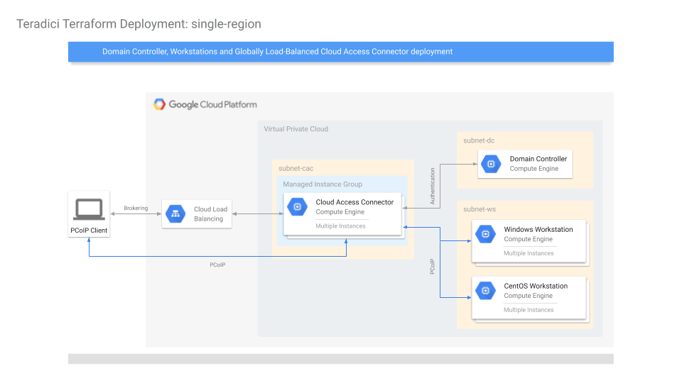
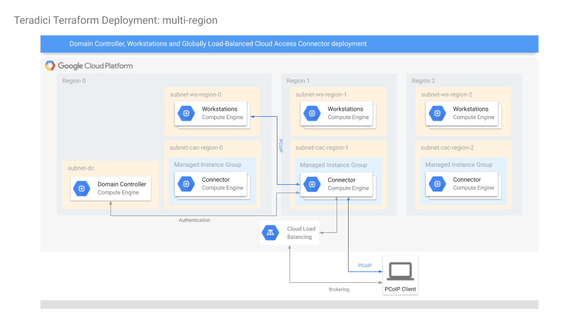
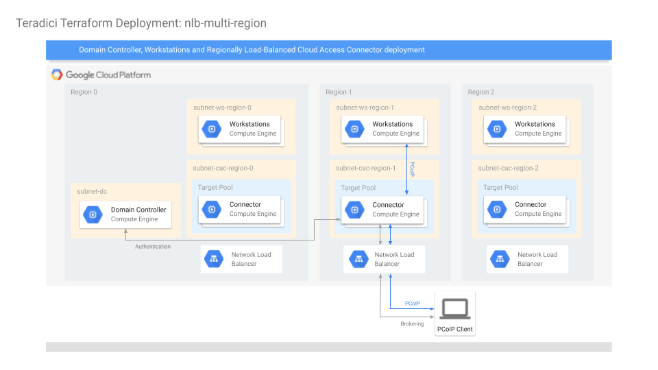

# Google Cloud Platform Deployments

## Table of Contents
1. [Introduction](#introduction)
2. [GCP Quickstart Tutorial](#gcp-quickstart-tutorial)
3. [Getting Started](#getting-started)
    1. [Requirements](#requirements)
    2. [GCP Setup](#gcp-setup)
    3. [Cloud Access Manager Setup](#cloud-access-manager-setup)
4. [Running Terraform Scripts](#running-terraform-scripts)
    1. [Customizing terraform.tfvars](#customizing-terraform.tfvars)
    2. [(Optional) Encrypting Secrets](#(optional)-encrypting-secrets)
        1. [Encryption Using Python Script](#encryption-using-python-script)
        2. [Manual Encryption](#manual-encryption)
    3. [Creating the deployment](#creating-the-deployment)
    4. [Add Workstations in Cloud Access Manager](#add-workstations-in-cloud-access-manager)
    5. [Start PCoIP Session](#start-pcoip-session)
    6. [Changing the deployment](#changing-the-deployment)
    7. [Deleting the deployment](#deleting-the-deployment)
5. [Architectures](#architectures)
    1. [single-connector](#single-connector)
    2. [multi-region](#multi-region)
    3. [nlb-multi-region](#nlb-multi-region)
    4. [dc-only](#dc-only)
6. [Troubleshooting](#troubleshooting)

---

## Introduction

There are two ways to create a Cloud Access Software deployment using this repository:
- [__GCP Quickstart Tutorial__](#gcp-quickstart-tutorial): for those who have less experience with the Command Line Interface (CLI) and Terraform, use this tutorial to get a deployment running with the least amount of effort. The quickstart will prepare most of the requirements for the user and call a script to deploy the _single-connector_ deployment using Terraform.
- [__Running Terraform Scripts__](#running-terraform-scripts): for those who are experienced with the CLI and Terraform, this is the primary way this repository is meant to be used. A user can choose between different types of deployments, variables can be customized, and deployment architecture can be modified to suit the user's needs.

## GCP Quickstart Tutorial

The quickest way to create a reference deployment on GCP is to run the Quickstart Python script in the Google Cloud Shell. The goal is to automate the creation of a [single-connector deployment](#single-connector) as much as possible by using auto-generated values for required parameters.

Click on the button below to clone this repository in your GCP Cloud Shell and launch the tutorial.

[](https://console.cloud.google.com/cloudshell/open?git_repo=https://github.com/teradici/cloud_deployment_scripts&open_in_editor=quickstart/gcp-cloudshell-quickstart.cfg&tutorial=quickstart/tutorial.md)

[This video](https://www.youtube.com/watch?v=lN2GesgvLKA) is also available to guide the viewer through the GCP Quickstart deployment process.

## Getting Started

Before starting, consider watching [this video](https://www.youtube.com/watch?v=ESzon04cW4Y) on how to use this repo to deploy a single-connector deployment on GCP from a Linux environment. The video guides the viewer through the entire deployment process from set up to tear down. It also shows how the deployment can be managed through Cloud Access Manager (CAM) and how end-users can connect to their machines using a PCoIP client. While the video shows the single-connector deployment, the process of creating other deployments is very similar. For deployment from a Windows environment, please see the relevant portions of our [AWS video](https://www.youtube.com/watch?v=hwEOoG4pmMQ).

### Requirements
- the user must have owner permissions to a GCP project
- a PCoIP Registration Code is needed. Contact Teradici sales or purchase subscription here: https://www.teradici.com/compare-plans
- a Cloud Access Manager Deployment Service Account is needed. Please see the Cloud Access Manager Setup section below.
- an SSH private / public key pair is required for Terraform to log into Linux hosts. Please visit [ssh-key-pair-setup](/docs/ssh-key-pair-setup.md) for instructions.
- if SSL is involved, the SSL key and certificate files are needed in PEM format.
- Terraform v0.13.5 or higher must be installed. Please download Terraform from https://www.terraform.io/downloads.html
- Terraform must be run in either the Command Prompt in a Windows environment or bash shell in a Linux environment. Note that PowerShell is not supported.

### GCP Setup
Although it is possible to create deployments in existing and currently in-use projects, it is recommended to create them in new projects to reduce chances of name collisions and interfering with operations of existing resources.

With a new GCP project:
- create a new service account with __Editor__ and __Cloud KMS CryptoKey Encrypter/Decrypter__ permissions. Create and download the credentials in JSON format. These credentials are needed by CAM to manage the deployment, such as creating workstations, monitoring workstation statuses, and providing power management features.  The credentials are also needed by the Terraform scripts to create the initial deployment.
- enable the following APIs in the GCP console or via the command ```gcloud services enable deploymentmanager.googleapis.com cloudkms.googleapis.com cloudresourcemanager.googleapis.com compute.googleapis.com dns.googleapis.com```:
    - Cloud Deployment Manager V2
    - Cloud Key Management Service (KMS)
    - Cloud Resource Manager
    - Compute Engine
    - Google Cloud DNS
- (Optional) For better security, create a Google KMS key ring and crypto key to encrypt secrets. Please refer to https://cloud.google.com/kms/docs/creating-keys for instructions to create keys.

### Cloud Access Manager Setup
Login to Cloud Access Manager Admin Console at https://cam.teradici.com using a Google G Suite, Google Cloud Identity, or Microsoft business account.

1. create a new deployment and submit the credentials for the GCP service account created above.
2. on the "Edit the Deployment" page, under "Deployment Service Accounts", click on the + icon to create a CAM Deployment Service Account.
3. click on "Download JSON file" to download the CAM Deployment Service Account credentials file which will be used in terraform.tfvars.

## Running Terraform Scripts

### Customizing terraform.tfvars
terraform.tfvars is the file in which a user specify variables for a deployment. In each deployment, there is a ```terraform.tfvars.sample``` file showing the required variables that a user must provide, along with other commonly used but optional variables. Uncommented lines show required variables, while commented lines show optional variables with their default or sample values. A complete list of available variables are described in the variable definition file ```vars.tf``` of the deployment.

Path variables in terraform.tfvars must be absolute and are dependent on the host platform:
- on Linux systems, the forward slash / is used as the path segment separator. ```gcp_credentials_file = "/path/to/cred.json"```
- on Windows systems, the default Windows backslash \ separator must be changed to forward slash as the path segment separator. ```gcp_credentials_file = "C:/path/to/cred.json"```

Save ```terraform.tfvars.sample``` as ```terraform.tfvars``` in the same directory, and fill out the required and optional variables.

### (Optional) Encrypting Secrets
terraform.tfvars variables include sensitive information such as Active Directory passwords, PCoIP registration key and the CAM Deployment Service Account credentials file. These secrets are stored in the local files terraform.tfvars and terraform.tfstate, and will also be uploaded as part of provisioning scripts to a Google Cloud Storage bucket.

To enhance security, the Terraform scripts are designed to support both plaintext and KMS-encrypted secrets. Plaintext secrets requires no extra steps, but will be stored in plaintext in the above mentioned locations. It is recommended to encrypt the secrets in the terraform.tfvars file before deploying. Secrets can be encrypted manually first before being entered into terraform.tfvars, or they can be encrypted using a python script located under the tools directory.

#### Encryption Using Python Script
The easiest way to encrypt secrets is to use the kms_secrets_encryption.py Python script under the tools/ directory, which automates the KMS encryption process. 

1. ensure the `kms_cryptokey_id` variable in terraform.tfvars is commented out, as this script will attempt to create the crypto key used to encrypt the secrets:
   ```
   # kms_cryptokey_id = "projects/<project-id>/locations/<location>/keyRings/<keyring-name>/cryptoKeys/<key-name>"
   ```
2. run the following command inside the tools directory:
   ```
   ./kms_secrets_encryption.py </path/to/terraform.tfvars>
   ```

The script will replace all the plaintext inside of terraform.tfvars with ciphertext. Any text files specified under the secrets section as a path will also be encrypted. 

The script can also reverse the encryption by executing it with the '-d' flag. See script's documentation for details (--help).

#### Manual Encryption
Alernatively, the secrets can be manually encrypted. To encrypt secrets using the Google KMS crypto key created in the 'GCP Setup' section above, refer to https://cloud.google.com/kms/docs/encrypt-decrypt. Note that ciphertext must be base64 encoded before being used in terraform.tfvars. 

1. create a KMS key ring and crypto key. Please refer to https://cloud.google.com/kms/docs/creating-keys for instructions to create keys.
2. in terraform.tfvars, ensure that the `kms_cryptokey_id` variable is uncommented and is set to the resource path of the KMS key used to encrypt the secrets:
   ```
   kms_cryptokey_id = "projects/<project-id>/locations/<location>/keyRings/<keyring-name>/cryptoKeys/<key-name>"
   ```
3. run the following command in GCP Cloud Shell or a Linux shell with gcloud installed to encrypt a plaintext secret:
   ```
   echo -n <secret> | gcloud kms encrypt --location <location> --keyring <keyring_name> --key <key_name> --plaintext-file - --ciphertext-file - | base64
   ```
   Encrypt and replace the values of the following variables in terraform.tfvars with the ciphertext generated. `<ciphertext`> should be replaced with the actual ciphertext generated - do not include < and >.
   ```
   dc_admin_password           = "<ciphertext>"
   safe_mode_admin_password    = "<ciphertext>"
   ad_service_account_password = "<ciphertext>"
   pcoip_registration_code     = "<ciphertext>"
   ```
4. run the following command in GCP Cloud Shell or a Linux shell with gcloud installed to encrypt the CAM Deployment Service Account JSON credentials file:
   ```
   gcloud kms encrypt --location <location> --keyring <keyring-name> --key <key-name> --plaintext-file </path/to/cloud-access-manager-service-account.json> --ciphertext-file </path/to/cloud-access-manager-service-account.json.encrypted>"
   ```
   Replace the value of the `cam_deployment_sa_file` variable in terraform.tfvars with the absolute path to the encrypted file generated.
   ```
   cam_deployment_sa_file = "/path/to/cloud-access-manager-service-account.json.encrypted"
   ```

### Creating the deployment
With the terraform.tfvars file customized:

1. run ```terraform init``` to initialize the deployment
2. run ```terraform apply``` to display the resources that will be created by Terraform
3. answer ```yes``` to start creating the deployment

A typical deployment should take 15 to 30 minutes. When finished, the scripts will display a number of values of interest, such as the load balancer IP address. At the end of the deployment, the resources may still take a few minutes to start up completely. Connectors should register themselves with the CAM service and show up in the CAM Admin Console.

### Add Workstations in Cloud Access Manager
Go to the CAM Admin Console and add the newly created workstations using "Add existing remote workstation" in the "Remote Workstations" tab.  Note that it may take a few minutes for the workstation to show up in the "Select workstation from directory" drop-down box.

### Start PCoIP Session
Once the workstations have been added to be managed by CAM and assigned to Active Directory users, a PCoIP user can connect the PCoIP client to the public IP of the Cloud Access Connector or Load Balancer, if one is configured, to start a PCoIP session.

### Changing the deployment
Terraform is a declarative language to describe the desired state of resources. A user can modify terraform.tfvars and run ```terraform apply``` again. Terraform will try to only apply the changes needed to acheive the new state.

Note that changes involving creating or recreating Cloud Access Connectors requires a new connector token from the CAM Admin Console. Create a new connector to obtain a new token.

### Deleting the deployment
Run ```terraform destroy``` to remove all resources created by Terraform.

## Architectures
This section describes the different types of deployment scenarios supported by Terraform scripts in this repository.

### single-connector
This is the simplest deployment; it creates a VPC with 3 subnets in the same region. The subnets are
- ```subnet-dc```: for the Domain Controller
- ```subnet-cac```: for the Connector
- ```subnet-ws```: for the workstations

Firewall rules are created to allow wide-open access within the VPC, and selected ports are open to the public for operation and for debug purposes.

A Domain Controller is created with Active Directory, DNS and LDAP-S configured. 2 Domain Admins are set up in the new domain: ```Administrator``` and ```cam_admin``` (default). Domain Users are also created if a ```domain_users_list``` CSV file is specified. The Domain Controller is given a static IP (configurable).

A Cloud Access Connector is created and registers itself with the CAM service with the given CAM Deployment Service Account credentials and PCoIP Registration code.

Domain-joined workstations are optionally created, specified by the following parameters:
- ```win_gfx_instance_count```: Windows Graphics workstation,
- ```win_std_instance_count```: Windows Standard workstation,
- ```centos_gfx_instance_count```: CentOS Graphics workstation, and
- ```centos_std_instance_count```: CentOS Standard workstation.

These workstations are automatically domain-joined and have the PCoIP Agent installed.  For graphics workstations, NVidia graphics driver are also installed.


### multi-region

#### Note: Due to recent changes in how Google Load Balancer process headers, your current Zero Client or Software Client version may need to be updated.  Please contact the maintainer (see below) for help if you have trouble connecting through the Load Balancer. A temporary workaround is to connect to the public IP of the Cloud Access Connector directly, bypassing the Load Balancer.

The difference between single-connector and multi-region deployments is that instead of creating only one Cloud Access Connector, the multi-region deployment creates Cloud Access Connectors in managed instance groups, in one or more GCP regions, behind a single GCP HTTPS Load Balancer. Also, instead of creating workstations in one region, multi-region deployments support deploying workstations to multiple regions.

In this deployment, a client initiates a PCoIP session with the public IP of the HTTPS Load Balancer, and the Load Balancer will select one of the Cloud Access Connectors from a region closest to the client to establish the connection. In-session PCoIP traffic goes through the selected Cloud Access Connector directly, bypassing the HTTPS Load Balancer.

For both the Cloud Access Connectors and workstations, the user must provide a list of regions and zones to create the compute instances in, the CIDRs of subnets for these instances, and the number of instances to create. At least one region and one Cloud Access Connector instance must be specified. Please refer to terraform.tfvars.sample for details.

The following diagram shows a deployment when only a single region is specified by the user.



The next diagram shows a deployment with Cloud Access Connectors and workstations specified for 3 regions. A user initiating a PCoIP session with the public IP of the GCP HTTPS Load Balancer will connect to one of the closest Cloud Access Connectors and use GCP's global network to connect to the workstation selected.



### nlb-multi-region

The Network load-balanced (NLB) multi-region deployment creates workstations and Cloud Access Connectors in one or more GCP regions. Unlike other deployments, the Cloud Access Connectors in this deployment will not be assigned public IP addresses; instead, clients will connect to their workstations via the public IP address of a regional network load balancer.

Note that this deployment is ideal for clients from different public IP addresses (e.g. in a work from home scenario). This deployment does not scale well for many clients connecting from the same IP address (e.g. employees from the same site) because the load balancer session affinity is based on source IP - which means clients connecting from the same public IP address will be handled by the same instance of Cloud Access Connector.

The user can specify which zones to deploy workstations and which regions to deploy Cloud Access Connectors. Cloud Access Connectors within a region will be spread out across available zones in the region, and will form a target pool behind a GCP external Network Load Balancer with a public IP.



### dc-only
A simple deployment of one Domain Controller, intended for testing Domain Controller operations.

Creates one VPC, one subnet and a single Domain Controller with ports opened
for ICMP, RDP and WinRM.  Domain Controller is configured with Acitve
Directory, DNS, LDAP-S.  One AD Service Account is also created.

## Troubleshooting
Please visit the [Troubleshooting](/docs/troubleshooting.md) page for further instructions.
